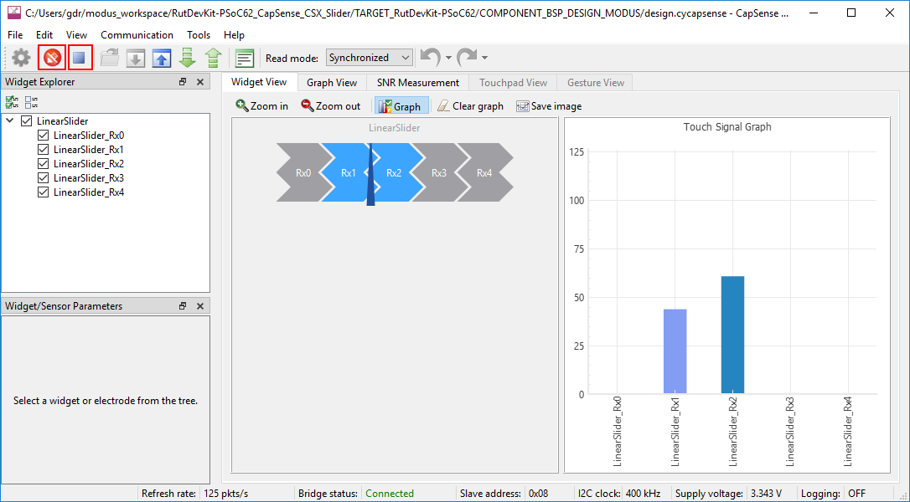
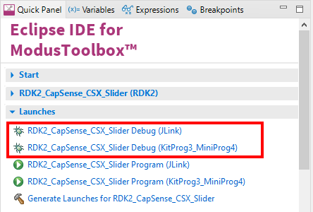

# RDK2 CapSense CSX Slider 

Rutronik Development Kit Programmable System-on-Chip CY8C6245AZI-S3D72 "CapSense CSX Slider" Example. 

This example is demonstrates how to use CapSense® Slider in CSX mode. 

 

## Requirements

- [ModusToolbox® software](https://www.infineon.com/cms/en/design-support/tools/sdk/modustoolbox-software/) v3.0

### Using the code example with a ModusToolbox IDE:

1. Import the project: **File** > **Import...** > **General** > **Existing Projects into Workspace** > **Next**.
2. Select the directory where **"RDK2_CapSense_CSX_Slider"** resides and click  **Finish**.
3. Update libraries using  a **"Library Manager"** tool.
4. Select and build the project **Project ** > **Build Project**.

### Operation

This example is to be used with KitProg3 UART for debug output and KitProg3 I2C for **CapSense Tuner** software. Only one peripheral may be used at the time. The firmware example initializes I2C library and enables CapSense Tuner software to connect, also initializes the CapSense peripheral which is configured using **CapSense Configurator** and processes the information gathered from the slider to control LED1 intensity from 0% to 100%.  

Launch the CapSense Tuner from the **Quick Panel** Tools section and select the I2C interface in KitProg3 UART menu as it is shown:

Click on **Connect** and **Start** to establish the connection via I2C. Select all the slider sensors to be monitored in **Widget Explorer**.

### Debugging

If you successfully have imported the example, the debug configurations are already prepared to use with a the KitProg3, MiniProg4, or J-link. Open the ModusToolbox perspective and find the Quick Panel. Click on the desired debug launch configuration and wait for the programming completes and debug process starts.

## Legal Disclaimer

The evaluation board including the software is for testing purposes only and, because it has limited functions and limited resilience, is not suitable for permanent use under real conditions. If the evaluation board is nevertheless used under real conditions, this is done at one’s responsibility; any liability of Rutronik is insofar excluded. 

